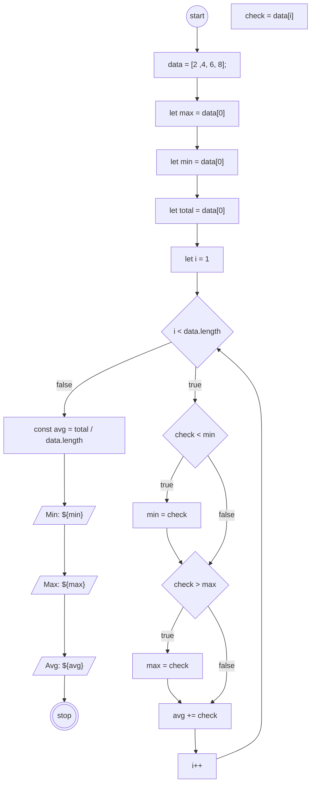

# Koda Academy - JavaScript 2

## Minitask 1

Memproses data number array untuk menghitung:

- Min
- Max
- Avg

### Flowchart

```mermaid
flowchart TD

start@{shape: circle}
stop@{shape: dbl-circ}

data@{shape: rect, label: "data = [2 ,4, 6, 8];"}

init-min@{shape: rect, label: "let max = data[0]"}
init-max@{shape: rect, label: "let min = data[0]"}
init-total@{shape: rect, label: "let total = data[0]"}

loop-1@{shape: rect, label: "let i = 1"}
loop-2@{shape: diamond, label: "i < data.length"}
loop-3@{shape: rect, label: "i++"}

check@{shape: rect, label: "check = data[i]"}

check-min@{shape: diamond, label: "check < min"}
min@{shape: rect, label: "min = check"}

check-max@{shape: diamond, label: "check > max"}
max@{shape: rect, label: "max = check"}

total@{shape: rect, label: "avg += check"}

avg@{shape: rect, label: "const avg = total / data.length"}
log-min@{shape: lean-r, label: "Min: ${min}"}
log-max@{shape: lean-r, label: "Max: ${max}"}
log-avg@{shape: lean-r, label: "Avg: ${avg}"}

start-->data
-->init-min-->init-max-->init-total

-->loop-1-->loop-2

loop-2--true
-->check-min--true-->min
-->check-max--true-->max
-->total
-->loop-3-->loop-2

check-min--false-->check-max--false-->total

loop-2--false-->avg
-->log-min-->log-max-->log-avg
-->stop

```
